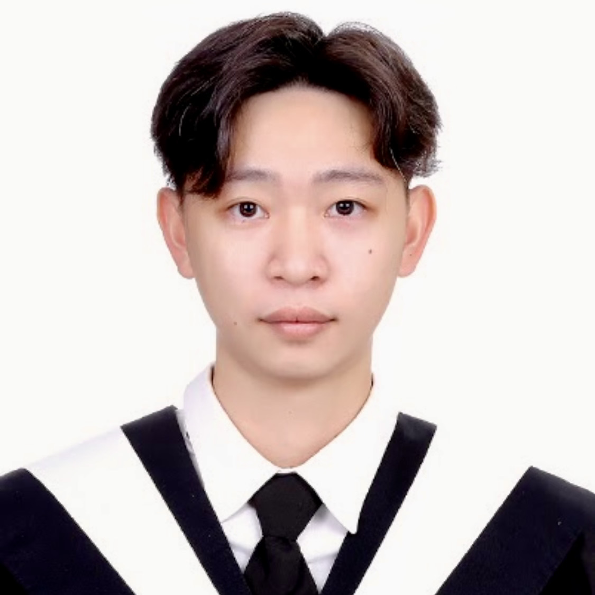

## About Me

Hi! I am Dennis. Currently, I am working as a research assistant at [Natural Language Processing and Sentiment Analysis Lab](https://academiasinicanlplab.github.io/), Academia Sinica.
I graduated from National Central University, with a Bachelor degree of Science in Computer Science.

## Research Interest

Machine learning theory, Natural language processing and Metric learning.

## Publications

**Yu-Hsuan Wu** and Eric Hsiao-kuang Wu, *AI-based College Course Selection Recommendation System-Performance Prediction and Curriculum Suggestion*, IEEE-IS3C(2020), **(Best Paper Award + Oral Presentation)**.  
Hou-Shen Lin, **Yu-Hsuan Wu** and Eric Hsiao-kuang Wu, *EasyIoT: Internet and Computational things for kids* Workshop of Mobile Computing(2018) **(Oral Presentation)**.  

## Typography

> :)
